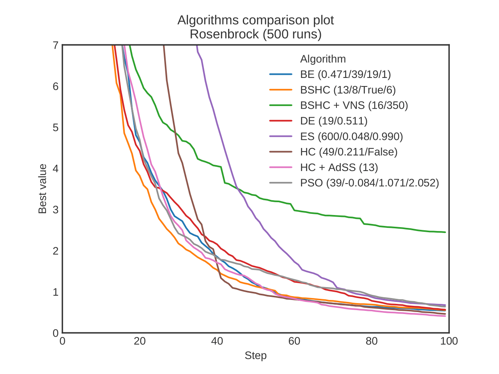
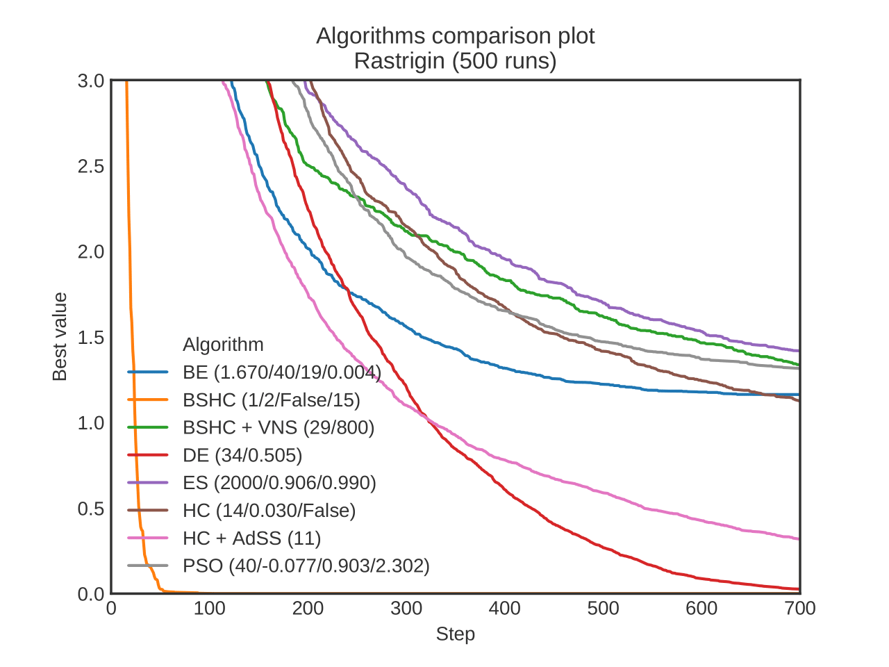

#### Results

More results, details of implementations and values of hiperparameters available in the [Final Report](Final_Report_PL.pdf).

Please note that *Simulated Annealing* is not presented on the plots, but it is implemented.

#### Attribution

The framework of Java code is based on [1]. Also, _Monte Carlo_ and vanilla _Hill Climbing_ algorithms were ported from that repo.
[1] https://bitbucket.org/pl-edu-pw-mini-optimization/tutorials/src/master/dotnet/
